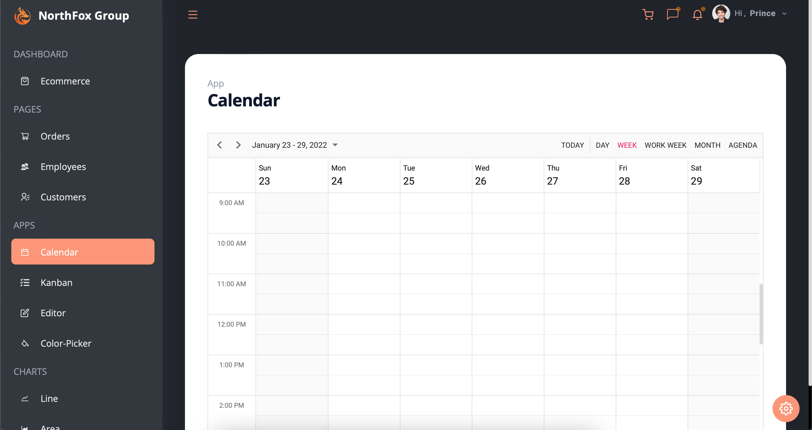

<h1 align="center" style="font-style:italic;">Admin Dashboard</h1>

## Download

Using Command :

```sh
git clone https://github.com/princu09/admin-dashboard-reactjs.git
```

Direct Zip :

[](https://github.com/princu09/admin-dashboard-reactjs/archive/refs/heads/Main.zip)

## Documentation

**Syncfusion React UI Components**

https://ej2.syncfusion.com/react/documentation/introduction/

```
Note : How to Freely Use SyncFusion
Follow Some Steps: 

Step 1 : Install SyncFusion From Official Website 

Step 2 : Add CDN in App.css 

This Link ===> @import url("https://cdn.syncfusion.com/ej2/material.css");

Step 3 : Open File ===> Project Folder > public > index.html

Step 4 : Copy this Code and Add to <Head> Tag.

=========================
<style>
  #js-licensing {
    visibility: hidden;
  }
</style>
=========================

Step 5 : You are Complate !! Enjoy..🎉

```

**Tailwindcss**

https://tailwindcss.com/docs/guides/create-react-app

**Screenshot :**

* Dark Mode





* Multi Colors Also Available


* White Mode 

